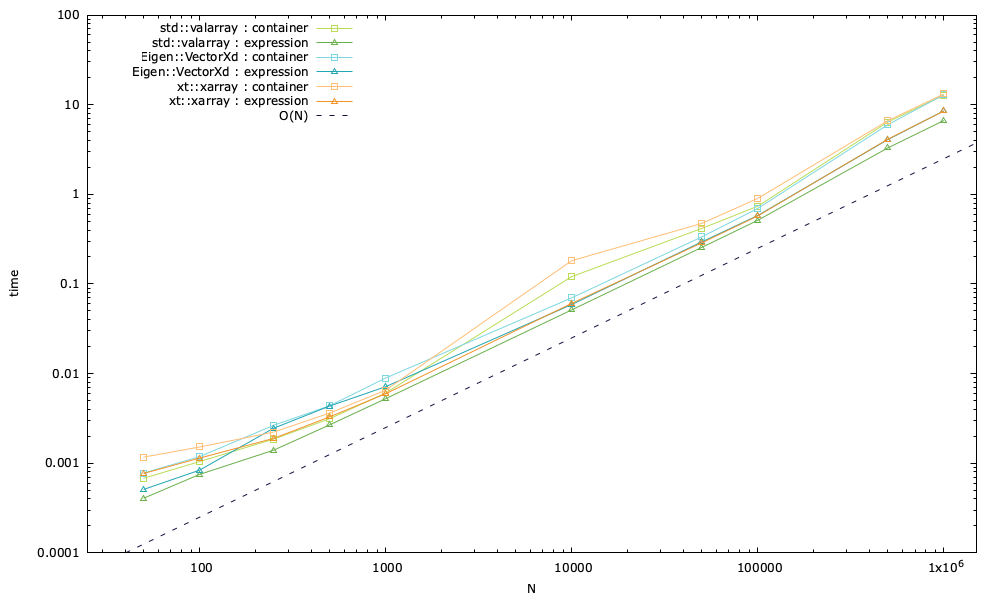

# Performance des expressions

Dans [ponio](https://github.com/hpc-maths/ponio) je voulais faire une optimisation consistant à renvoyer une expression plutôt qu'un conteneur contenant l'évaluation de l'expression.

Ce mécanisme est synthétisé dans les expressions :

```cpp
  container_t fu = f(abxpy(a, b, x, y));
```

correspondant au calcul $k_i = f(u^n + \Delta t \sum_j a_{ij}k_j)$, l'expression $\sum_j a_{ij}k_j$ correspondant à un produit scalaire, avec un $a$ variable et donc peut se résumer à un `axpy`, ici on rajoute un scalaire $b$ correspondant au $\Delta t$. La fonction $f$ est construite ici pour prendre une *r-value*, et renvoyer une expression qui sera nulle quoi qu'il arrive (`0.5*u - u + 0.5*u`).

On souhaite tester la différence dans la fonction `abxpy` qui calcule : $a\cdot b \cdot x + y$, entre renvoyer une expression et un conteneur. Deux fonctions sont construites pour tester cela :

```cpp
template <typename container_t, typename value_t>
auto abxpy_auto(value_t const &a, value_t const &b, container_t const &x,
                container_t const &y) {
  return a * (b * x) + y;
}

template <typename container_t, typename value_t>
container_t abxpy_container(value_t const &a, value_t const &b,
                            container_t const &x, container_t const &y) {
  return a * (b * x) + y;
}
```

On lance 5000 fois ce test, avec des vecteurs de différentes tailles allant de 50 à 1'000'000 (voir [time.cc](time.cc) pour plus de détails). Et on obtient les résultats suivants, synthétisé dans le graphique suivant.



En gros, dans notre cas, puisqu'on ne modifie pas l'expression $u^n + \Delta t \sum_j a_{ij}k_j$ nous ne voyons pas de réelle différence sur le temps de restitution de ces calculs entre renvoyer un conteneur avec les valeurs ou une expression. Pour des tailles inférieures à 1000, on peut observer que le temps de restitution est plus élevé avec une expression qu'un conteneur, au delà on a toujours un léger gain à renvoyer une expression.
